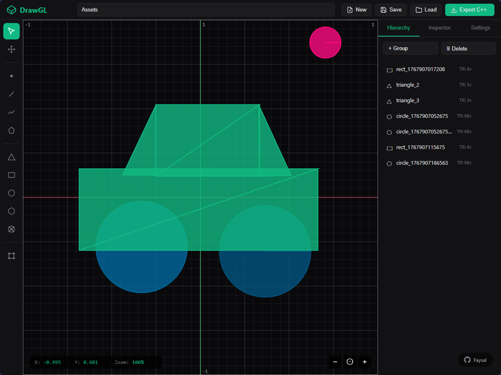
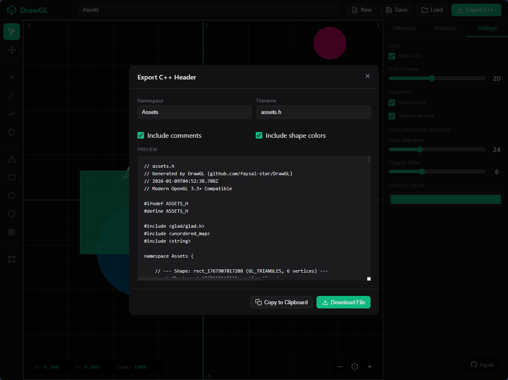
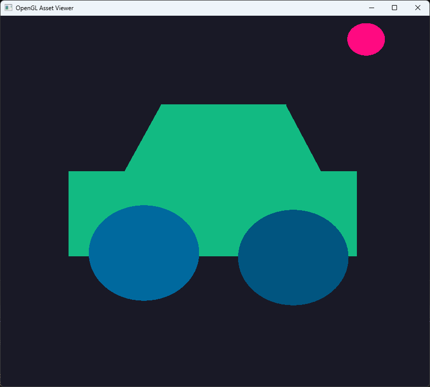

# DrawGL - OpenGL Asset Forge

A browser-based 2D drawing tool that exports OpenGL-ready C++ header files with vertex data. Draw shapes visually and get plug & play code for your OpenGL projects.

Live Demo: [DrawGL](https://faysal-star.github.io/DrawGL/)

<div align="center">
    
    <p><em>DrawGL Drawing Canvas</em></p>
</div>

## Features

### Drawing Tools
- **Primitives**: Points, Lines, Line Strips, Line Loops, Triangles, Triangle Strips, Triangle Fans
- **Shapes**: Rectangles, Circles, Polygons, Custom Polylines
- **Color Picker**: Custom colors for each shape
- **Grid System**: Configurable grid with snap-to-grid support
- **Vertex Snap**: Snap to existing vertices for precision

### Editing
- **Select & Move**: Click to select, drag to reposition shapes
- **Vertex Editor**: Edit individual vertices (Tool: E)
- **Inspector Panel**: Modify shape properties, primitive types, and colors
- **Hierarchy**: Organize and manage all shapes in your project

### Keyboard Shortcuts
- `V` - Select tool
- `M` - Move tool
- `P` - Point
- `L` - Line
- `K` - Polyline
- `O` - Line Loop
- `T` - Triangle
- `R` - Rectangle
- `U` - Rounded Rectangle
- `C` - Circle (Arc)
- `G` - Polygon
- `F` - Triangle Fan
- `E` - Vertex Edit
- `Ctrl+S` - Save project
- `Ctrl+E` - Export C++
- `Ctrl+D` - Duplicate selected
- `Delete` - Delete selected
- `Escape` - Clear selection

### Save & Load
- **Browser Storage**: Auto-save to local storage
- **File Export/Import**: Save projects as `.drawgl.json` files to your device
- **Load Options**: Load from browser storage or device files

### OpenGL Export
- Export as modern OpenGL 3.3+ compatible C++ header files
- Interleaved vertex data (position + color)
- Ready-to-use VAO/VBO setup functions
- Namespace customization
- Optional comments and color data

## How to Use

### 1. Create Assets
1. Open `index.html` in a web browser (needs server to avoid CORS issues, use `Live Server` or similar)
2. Or use the [Live Demo](https://faysal-star.github.io/DrawGL/)
3. Use the toolbar to draw shapes on the canvas
4. Customize colors and properties in the Inspector panel
5. Name your project (top center input)

### 2. Export C++ Header
1. Click the **"Export C++"** button
2. Configure:
   - Namespace (e.g., `Assets`)
   - Filename (e.g., `assets.h`)
   - Toggle comments and colors
3. Click **"Download File"**

### 3. Use in OpenGL Project
Place the exported header in your project:
```
your_project/
├── assets.h          ← Your exported header
├── main.cpp
└── ...
```

In your C++ code:
```cpp
#include "assets.h"

// Initialize all shapes (call once)
Assets::initAllShapes();

// In your render loop
Assets::drawShape("shape_name");
// or draw all at once
Assets::drawAll();

// Cleanup when done
Assets::cleanup();
```

### 4. Demo Example
Check the `demo/` folder for a complete working example:
- `main.cpp` - Shows how to initialize and draw assets
- `gl_template.h` - Basic OpenGL setup (GLAD, GLFW Boilerplate)
- `assets.h` - Sample exported assets

### Demo Screenshot:
<div align="center">
    
    <p><em>Export configuration @ C++ Header for OpenGL</em></p>
</div>

<div align="center">
    
    <p><em>OpenGL Output</em></p>
</div>


## File Format
Saved projects use `.drawgl.json` format containing:
- All shape vertex data
- Colors and primitive types
- Grid and snap settings
- Project metadata

## Requirements
- For C++ demo: OpenGL 3.3+, GLAD, GLFW

## Tips
- Use snap-to-grid for aligned shapes
- Use snap-to-vertex for connecting shapes precisely
- Export with comments for better code readability
- Save frequently to browser storage and export backups to device

---

**Author**: [Faysal](https://github.com/faysal-star)  
